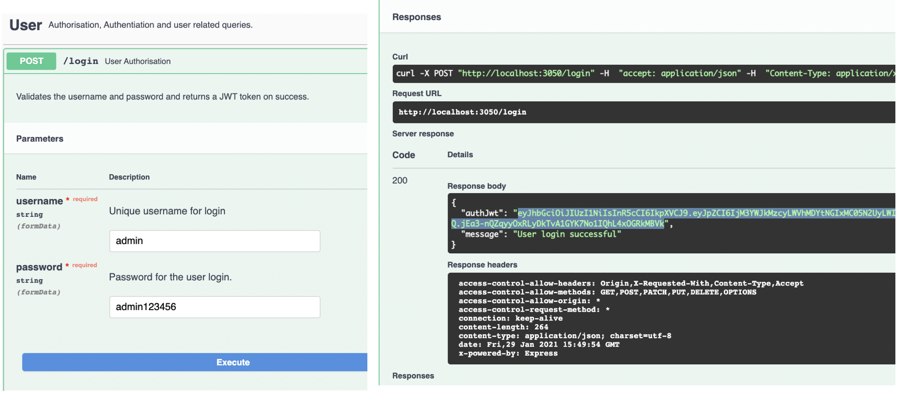
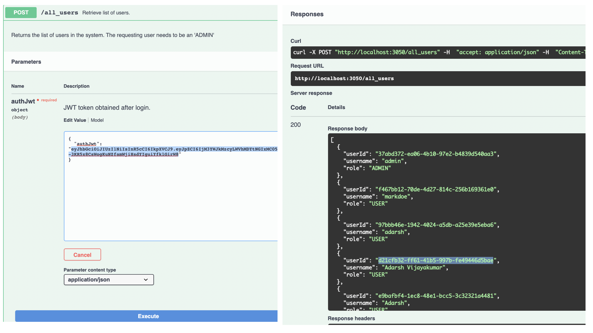
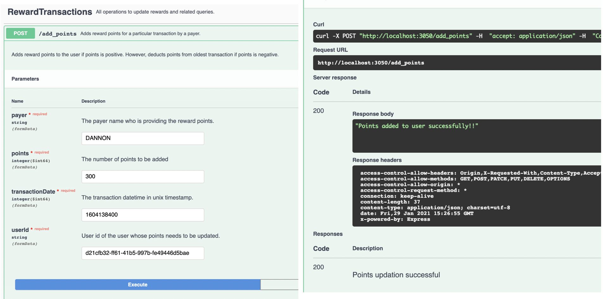
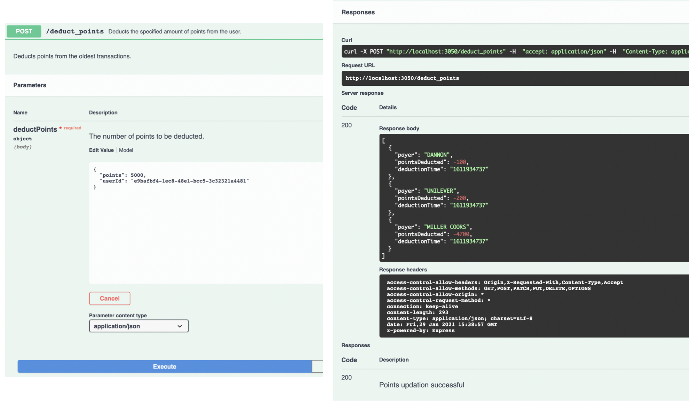
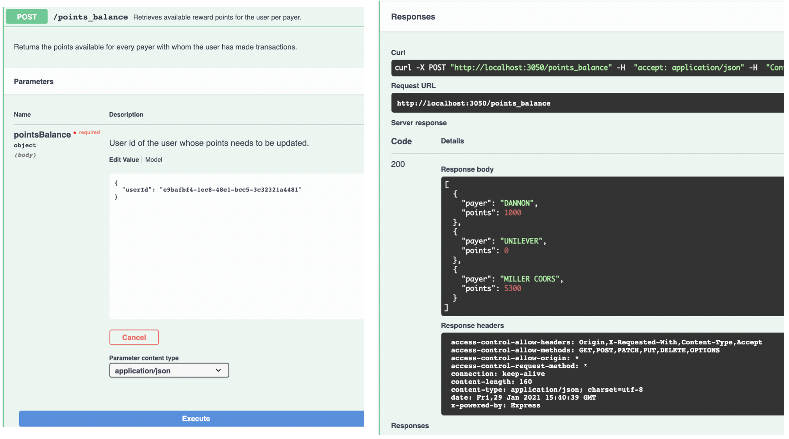

# rewards-web-service

This is a web API service built using node.js and express.js. The service exposes basic end points to create user and update reward points of a user and retrieve the same.

## Installation and Run

### Requirements

- [node.js](https://nodejs.org/en/) (version > 12)
- npm (version > 6.13 usually included with node.js)

### Node Packages Used

- cors
- md5
- sqlite3
- express
- swagger-ui
- uuid

### RUN

Install depedencies for the service. Run the following command in the project directory.

```cmd
npm install
```
Note: <b>Only if you are using MacOS and npm install fails </b>.
Then you might probably have to delete and reinstall the (latest) xcode again. For that follow these commands
```cmd
sudo rm -rf $(xcode-select -print-path)
xcode-select --install

Now install npm modules by
npm install
```

Start the service by running the following command in the project directory.

```cmd
node app.js
```

After running the above command, the service will be available at: http://localhost:3050.

The service is equipped with the swagger overlay to easily test and play around the exposed api endpoints. The swagger playground also explains each and every endpoint in detail. therefore refer the [swagger](http://localhost:3050) after launching the service for complete API specifications.

## User Guide

Once the service is running follow these steps to get started.

- Create a new user by using <i>register</i> endpoint.
- Login to the system by using admin/admin123456. (to get the userId of this new user)
- The successful login will return a JWT token called <i>authJwt</i>. Pass this token in the <i>all_users</i> request to get a list of users. This will return a list of users with user details including userId, username and role.
- Use the userId returned in the <i>all_users</i> request in further operations like <i>add_points</i>, <i>deduct_points</i>, <i>points_balance</i> endpoints.

Note: <i>add_points</i> endpoint expects transactionDate in unix timestamp format. This is to store the timestamp efficiently across timezones and also a standard of communication across services.

## API Specifications

### User Endpoints

<details>
  <summary>login</summary>
  The endpoint can be used to login to the system.<br/>
  <b>Request Url: </b>http://localhost:3050/login
</details>
<details>
  <summary>register</summary>
  
  The endpoint can be used to create a new user.<br/>
  <b>Request Url: </b>http://localhost:3050/register
</details>
<details>
  <summary>all_users</summary>
  
  The endpoint returns all the users present in the system.<br/>
  <b>Request Url: </b>http://localhost:3050/all_users
</details>

### Rewards Endpoints

<details>
  <summary>add_points</summary>
  
  The endpoint adds reward points for a specific user and specific payer. If the points specified is positive, then the points will be added to the user for that payer. If specified points is negative, it deducts the points for the user from the specific payer from the oldest entry in the transactions table.<br/>
  <b>Request Url: </b>http://localhost:3050/add_points
</details>
<details>
  <summary>deduct_points</summary>
  
  The endpoint deducts the specified amount of points from the user in the order of oldest reward transactions.<br/>
  <b>Request Url: </b>http://localhost:3050/deduct_points
</details>
<details>
  <summary>points_balance</summary>
  
  The endpoint retrieves the available points balance for the user for every payer the user has ever made transactions with.<br/>
  <b>Request Url: </b>http://localhost:3050/points_balance
</details>

## Results:
### Login to system as admin
You can see the JWT token (authJWT) in the response body.
 

### Get all users in the system
You can see the userId of all users. Take the required user's userId. 
 

### Add points 
Add points to user account for specific payer and date (in unix timestamp).
 

### Deduct points
Deduct points from the user account. It returns a list of [payer, points deducted] for each call to spend points.
 

### Points balance
Returns points balance of the user that would list all positive points per payer.
 
